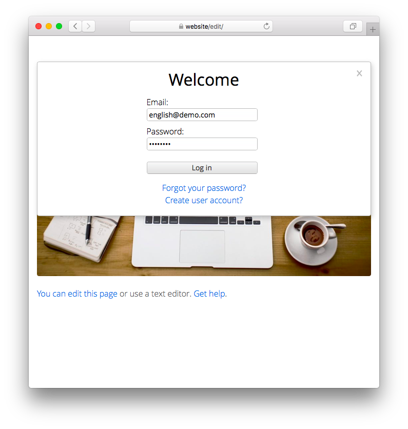

<a href="README-de.md">Deutsch</a> &nbsp; <a href="README.md">English</a> &nbsp; <a href="README-sv.md">Svenska</a>

# Demo 0.9.1

Automatisk inloggning för att testa en webbplats. [Prova demon](https://datenstrom.se/sv/yellow/demo/).

## Hur man installerar ett tillägg

[Ladda ner ZIP-filen](https://github.com/annaesvensson/yellow-demo/archive/refs/heads/main.zip) och kopiera den till din `system/extensions` mapp. [Läs mer om tillägg](https://github.com/annaesvensson/yellow-update/tree/main/README-sv.md).

## Hur man använder en automatisk inloggning

Inloggningssidan är tillgänglig på din webbplats som `http://website/edit/`. Behåll inmatningsfälten oförändrade och klicka på `Logga in`. Du kan använda vanliga navigeringen, göra ändringar och se resultatet omedelbart. Användarkontot är dock begränsat och du får endast redigera vissa sidor. Alla [användarkonton](https://github.com/annaesvensson/yellow-edit/tree/main/README-sv.md) lagras i filen `system/extensions/yellow-user.ini`.

## Utvecklare

Anna Svensson. [Få hjälp](https://datenstrom.se/sv/yellow/help/).
